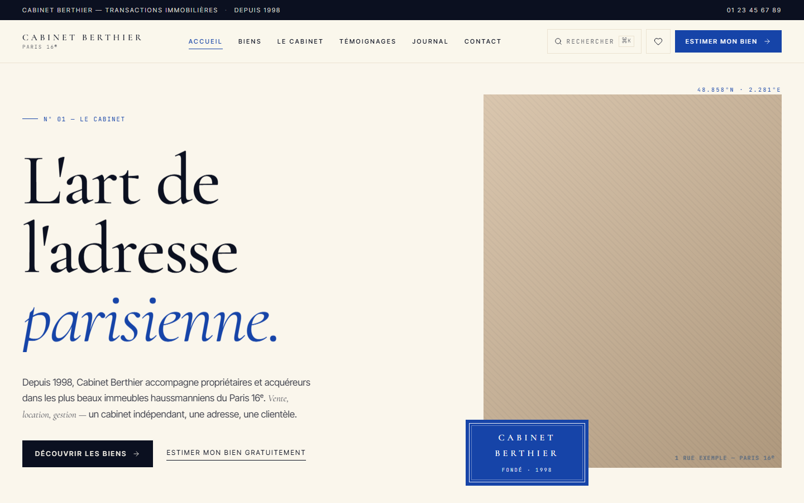
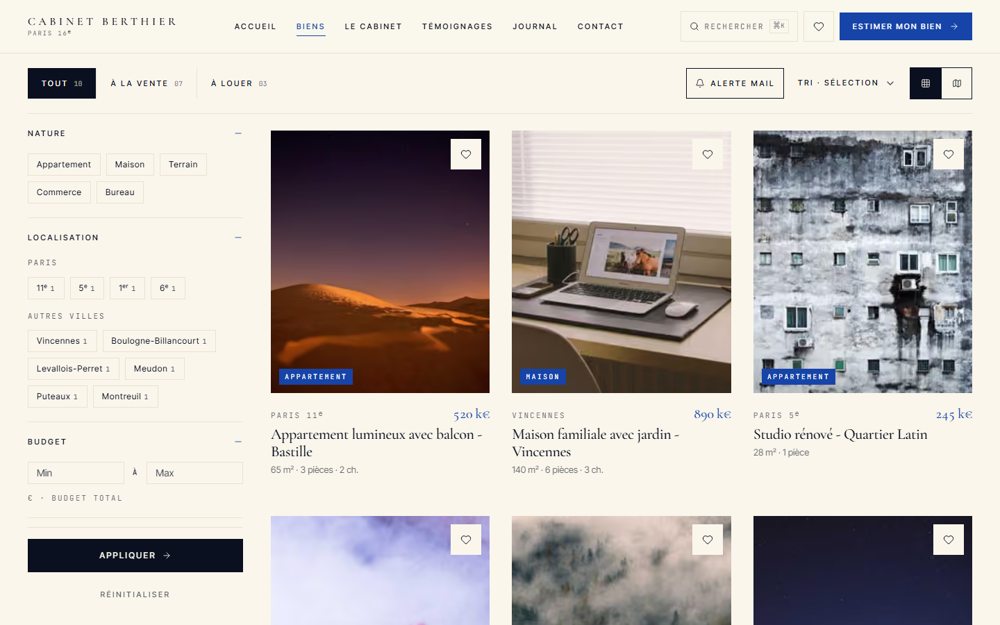
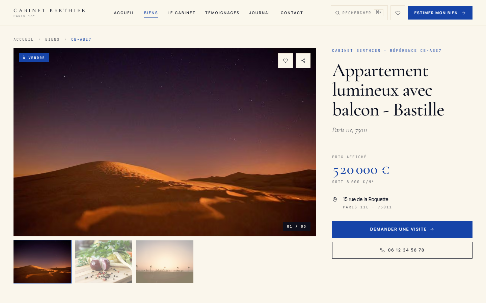
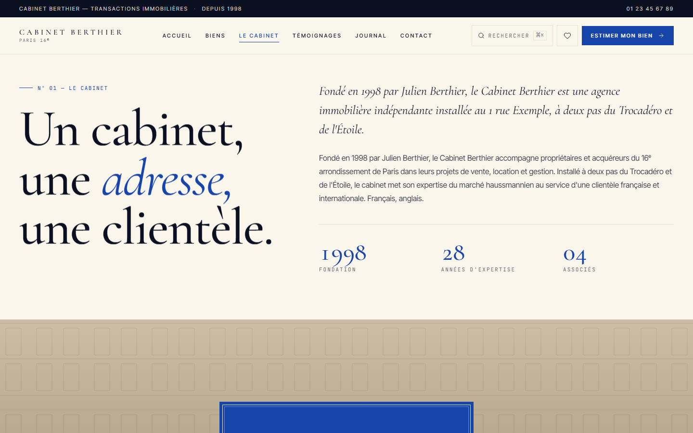
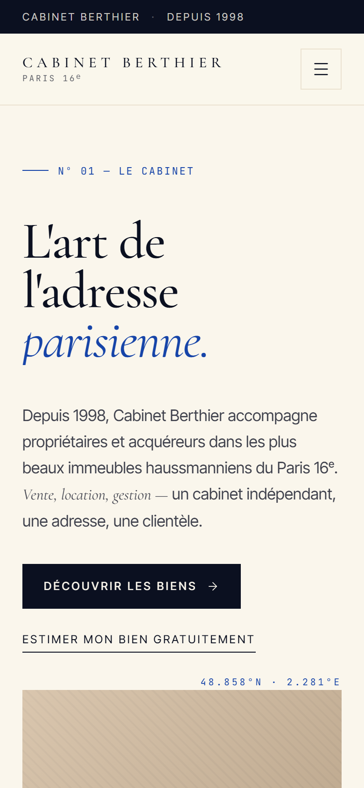
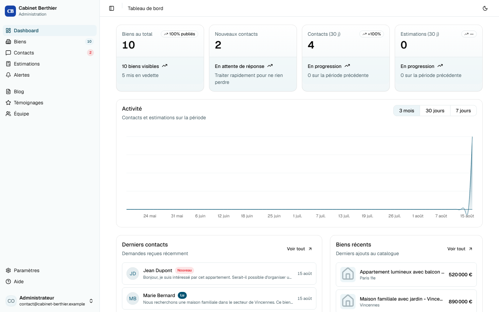
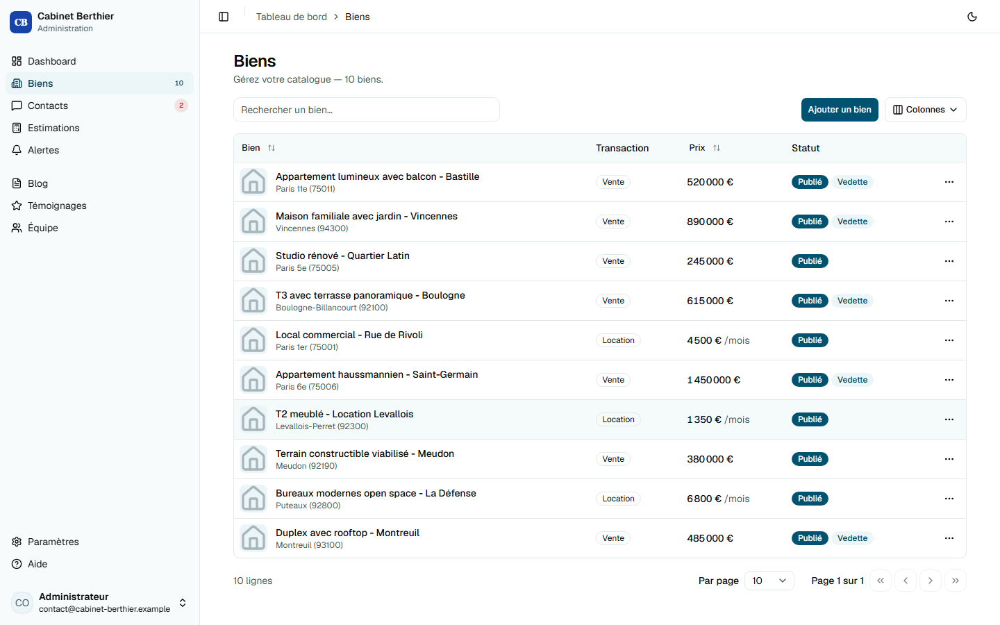

# Site vitrine + admin pour agence immobilière

Un site web complet pour une agence immobilière : la vitrine publique (recherche de biens, fiches détaillées, estimation en ligne, blog, formulaires de contact) et le panel d'administration qui va avec (gestion des biens, des contacts, des agents, du contenu).

C'est un projet client que j'ai construit de bout en bout — design, développement, base de données, déploiement. Je le partage ici comme démonstration technique : **toutes les données affichées sont fictives** (nom d'agence, adresse, coordonnées, témoignages, articles de blog). Il n'y a aucun lien avec un client réel — le nom "Cabinet Berthier" et le contenu qui va avec ont été inventés pour l'occasion.

**[→ Voir le site en ligne](https://cabinet-berthier.vercel.app)**

## Aperçu

<table>
<tr>
<td width="50%"></td>
<td width="50%"></td>
</tr>
<tr>
<td width="50%"></td>
<td width="50%"></td>
</tr>
</table>



**Admin** — CRUD biens, contacts, estimations, agents, blog, témoignages, réglages agence.

<table>
<tr>
<td width="50%"></td>
<td width="50%"></td>
</tr>
</table>

## Ce que ça fait

**Côté public (`apps/web`)**
- Recherche de biens avec filtres (type, budget, surface, quartier...) et vue carte
- Fiches détaillées : galerie photo, DPE/GES, documents, biens similaires
- Formulaire d'estimation en ligne, formulaire de contact contextuel selon le besoin (vendre / acheter / louer / gérer)
- Alertes email personnalisées, favoris, biens vus récemment
- Blog et témoignages clients
- SEO complet (metadata, JSON-LD, sitemap) et de bonnes perfs (ISR, images optimisées)

**Côté admin (`apps/admin`)**
- CRUD complet sur les biens (photos, prestations, DPE), les agents, les articles, les témoignages
- Suivi des messages de contact et des demandes d'estimation
- Gestion des paramètres de l'agence et des préférences de notification par agent

## Stack technique

- **Next.js 16** (App Router, React 19)
- **Turborepo** en monorepo (npm workspaces)
- **Supabase** (Postgres, auth, storage, RLS)
- **Tailwind CSS v4** + **shadcn/ui** (couleurs en oklch, dark mode)
- **Resend** pour les emails transactionnels
- **MapLibre** pour les cartes

## Structure

```
apps/web/          → site public (Next.js)
apps/admin/         → panel d'administration (Next.js)
packages/ui/         → composants shadcn + thème (brand.css)
packages/shared/      → client Supabase, types, utils, constantes
packages/emails/       → templates d'emails (React Email)
supabase/               → migrations SQL + seed de démo
```

Le code est organisé en deux couches : un **moteur** stable (accès aux données, actions serveur, auth, emails — dans `lib/`, `packages/shared`, `apps/admin`) et une **carrosserie** libre (pages, composants visuels, styles — dans `app/`, `components/`, `brand.css`). L'idée est de pouvoir refaire entièrement le design d'un site sans jamais toucher à la logique métier.

## Lancer le projet en local

### 1. Cloner et installer

```bash
git clone <url-de-ce-repo>
cd immo-template-demo
npm install
```

### 2. Créer un projet Supabase

1. Créer un projet sur [supabase.com](https://supabase.com)
2. Créer un utilisateur admin dans *Authentication > Users*
3. Pousser le schéma :

```bash
npx supabase link --project-ref <votre-ref>
npx supabase db push
```

Le fichier `supabase/seed.sql` contient des données de démo (agents et biens fictifs) que vous pouvez charger pour tester sans partir d'une base vide.

### 3. Variables d'environnement

```bash
cp .env.example .env.local
npm run setup:env
```

| Variable | Description | Requis |
|----------|-------------|--------|
| `NEXT_PUBLIC_SUPABASE_URL` | URL du projet Supabase | Oui |
| `NEXT_PUBLIC_SUPABASE_ANON_KEY` | Clé publique anon | Oui |
| `SUPABASE_SERVICE_ROLE_KEY` | Clé service role (uploads) | Oui |
| `NEXT_PUBLIC_SITE_URL` | URL publique du site | En prod |
| `RESEND_API_KEY` | Clé API Resend (emails) | Non |
| `REVALIDATION_SECRET` | Secret partagé admin ↔ web pour invalider le cache | En prod |
| `NEXT_PUBLIC_PLAUSIBLE_DOMAIN` | Domaine Plausible Analytics | Non |

### 4. Démarrer

```bash
npm run dev
```

- Vitrine : http://localhost:3000
- Admin : http://localhost:3001

## Déployer sur Vercel

Deux projets Vercel séparés, tous deux pointant sur ce repo :

| App | Root Directory | Exemple de domaine |
|-----|-----------------|---------------------|
| Vitrine | `apps/web` | `mon-agence.fr` |
| Admin | `apps/admin` | `admin.mon-agence.fr` |

Ajoutez les mêmes variables d'environnement que ci-dessus sur chaque projet Vercel, en pointant `NEXT_PUBLIC_SITE_URL` vers l'URL de production de la vitrine (utilisée par l'admin pour les liens dans les emails et l'invalidation du cache).

Pour les emails : créer un compte [Resend](https://resend.com), vérifier votre domaine, puis mettre à jour l'adresse d'expédition dans `packages/shared/src/resend/send.ts`.

## Autres scripts utiles

| Script | Description |
|--------|-------------|
| `npm run dev` | Les deux apps en parallèle |
| `npm run build` | Build de production |
| `npm run lint` | Lint |
| `npm run setup:env` | Symlinks `.env.local` vers les deux apps |

## Cache

Les pages publiques utilisent l'ISR (`unstable_cache` + tags) : biens et fiches (30 min), paramètres et agents (1h). L'admin déclenche une invalidation immédiate via `POST /api/revalidate` dès qu'un bien est modifié, donc le site public reste à jour sans attendre la revalidation programmée.
